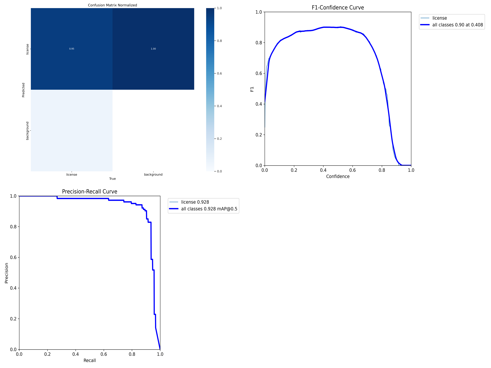

🇬🇧 [English](./README.md) | 🇹🇼 [繁體中文](./README-zh-tw.md)

# YOLOv8車牌識別

此專案使用 YOLOv8 物件偵測方法做為應用，展示其如何在真實世界的車輛識別、交通監控、和地理空間分析等方面都能發揮極高效能。此外，專案還整合了 Google Cloud Platform (GCP) Vision AI 的光學字元辨識(OCR) 功能，能精準辨識車牌，並且擷取重要的媒體捕獲數據，如日期，時間，和地理位置。這些數據可增強分析並支持交通分析和地點為基礎的應用。

## 功能

* `車牌識別`: 利用 YOLOv8 進行識別和擷取車牌號碼的圖像和視訊。

* `媒體捕獲數據`: 除了車牌信息之外，專案將獲取包括日期、時間、地理坐標（緯度和經度）在內的重要媒體捕獲數據，這些資料豐富了分析並擴展了專案的實用性到各種真實世界的應用。

## 設置

要使用此專案，您需要安裝幾個依賴並設置您的環境。以下是開始的步驟：

### 先決條件

- Python 3.8 或更高版本
- PyTorch（如果要使用 GPU 加速，需要支援 MPS 或 CUDA）
- Ultralytics 的 YOLOv8 庫
- OpenCV

### 安裝方式

1. 將資料儲存庫複製到您的本地電腦：

    ```sh
    git clone https://github.com/yihong1120/YOLOv8-License-Plate-Insights.git
    ```

2. 下載[車牌數據集](https://1drv.ms/u/s!AiltJg0lR4P-ylzt6zyr3s3tEpij?e=r5E9ja)，原始數據集連接是[這裡](https://www.kaggle.com/datasets/andrewmvd/car-plate-detection?resource=download)。

3. 瀏覽到您剛剛複製的資料夾：

    ```sh
    cd YOLOv8-License-Plate-Detection
    ```

4. 安裝所需的 Python 庫：

    ```sh
    pip install -r requirements.txt
    ```

## 使用方式

如果您想使用此模型進行車牌偵測和識別，您需要有希望進行這項操作的車輛圖像。

1. 修正 `train.py` 中的 `weights_path` 以指向您的 YOLOv8 權重檔案。要在 Google Colab 上訓練模型，您可以使用這個[檔案](License_Plate_Detection.ipynb)：

    ```python
    python train.py
    ```

2. 執行車牌偵測脚本。需啟用 Vision AI api，您可以參考 [Vision-API-Tutorial](manual/Vision_API_Tutorial-zh-tw.md)：

    ```sh
    python inference.py
    ```

3. 結果將會顯示並且可被保存為來述帶著被標示的車牌圖像，你可以看到下方的圖像輸出。這是執行後傳回的訊息。


    ```
    {'DateTime': '2023:11:17 19:01:29', 'GPSLatitude': 24.15218611111111, 'GPSLongitude': 120.67495555555556}

    0: 384x640 1 license, 196.7ms
    Speed: 6.6ms preprocess, 196.7ms inference, 16.4ms postprocess per image at shape (1, 3, 384, 640)
    License: NNG 9569
    Saved the image with the license plate to ./medias/yolov8_Scooter.jpg
    ```

## 自定義訓練

對於 Linux 或 Mac 使用者，您可以直接執行下方指令來完成整體的過程。

    bash demo.sh

如果您希望在自訂車牌數據上訓練您自己的 YOLOv8 模型，您需要按照以下的步驟：

1. 預備你的資料集，依照 YOLOv8 的需求（適當地標註你的圖象）。
2. 更新 `data.yaml` 中的路徑以指向您的訓練和驗證數據集，還有類別數。
3. 執行訓練脚本：

    ```sh
    python train.py --img 640 --batch 16 --epochs 100 --data data.yaml --weights yolov8n.pt
    ```

4. 訓練結束後，您可以在 `runs/train/exp*/weights` 可找到表現最佳的權重。

## 實驗

我們執行了一項使用以下參數的實驗：
- num_augmentations = 5
- epochs = 100
- model_name = yolov8n.pt



1. `Confusion Matrix Normalized`: 此圖顯示了模型預測的標準化結果。強烈的對角項目（'license' 為 0.95, 'background' 為 1.00）表示模型表現非常優秀，其真陽性率高，假陰性和假陽性率低。

2. `Precision-Recall Curve`: 此曲線用來評價物體偵測模型在不同閾值上的效能。高曲面下面積（AUC）為 0.928，這是極好的，表示模型能以高精度和召回率區分 'license' 類與所有其他類。

3. `F1-Confidence Curve`: 此曲線顯示了在不同信心閾值下的 F1 分數（精准度和召回率的和諧平均數）。閾值在 0.408 的 F1 分數達到 0.90 的最高點，這表示在這個閾值下，模型達到了精准度和召回率的良好平衡。

## 部署

該模型將部署在Google App Engine（GAE）中，作為API。 我們決定利用 Flask 來產生 API 功能。 您可以參考[app.py](./app.py)並使用下列命令在本機執行API：

    gunicorn app:app

模型可以部署到GAE中，可以參考這個[手冊](./manual/Flask_GAE_Deployment_Tutorial-zh.tw.md)。

## 許可證

這項專案的開源許可證為 MIT。關於更多資訊，請參閱此 [LICENSE](./LICENSE) 文件。

## 致謝

- YOLOv8 模型和實作來自 Ultralytics。有關更多資訊，請參訪他們的 [GitHub 儲存櫃](https://github.com/ultralytics/ultralytics)。