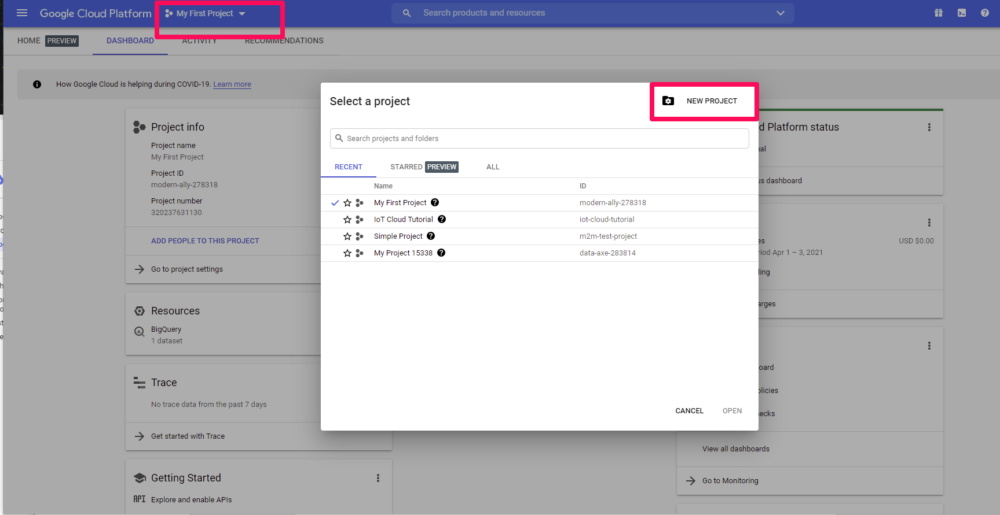

🇬🇧 [English](./Vision-API-Tutorial.md) | 🇹🇼 [繁體中文](./Vision-API-Tutorial-zh-tw.md)

# Google Cloud Vision API 設置教學

本教學將引導您完成 Google Cloud Vision API 的設置。

## 步驟 1: 建立 Google Cloud 專案

1. **前往 Google Cloud 控制台**。
   - 在你的網路瀏覽器中打開 [Google Cloud 控制台](https://console.cloud.google.com/).

2. **建立一個新的專案**。
   - 在這個頁面頂端點選專案下拉選單。
   - 選擇 "新建專案" 並填入細節。
   - 點擊 "建立"。

   

## 步驟 2: 啟用 Vision API

1. **開啟 API 圖書館**。
   - 在 Cloud Console 中，前往 "API 以及服務" > "圖書館"。

2. **搜尋 Vision API**。
   - 在搜尋欄中輸入 "Vision" 並選擇 "Cloud Vision API"。

3. **啟用 API**。
   - 點擊 "啟用" 按鈕。

   

## 步驟 3: 建立服務帳戶並下載金鑰

1. **建立一個服務帳戶**。
   - 導覽到 "IAM 與管理" > "服務帳戶"。
   - 點選 "建立服務帳戶"。
   - 填入細節並點擊 "建立"。

2. **分配角色**。
   - 分配所需要的角色（例如，"檢視者"，"編輯者"）並點擊 "繼續"。

3. **生成並下載金鑰**。
   - 點擊建立的服務帳戶。
   - 前往 "金鑰" 頁面並點擊 "新增金鑰" > "建立新金鑰"。
   - 選擇 "JSON" 並點擊 "建立"。金鑰檔案將會自動下載。

   

## 步驟 4: 設定環境變數

1. **設置 `GOOGLE_APPLICATION_CREDENTIALS`**。
   - 在你的本地機器上，設定環境變數以指向下載的 JSON 金鑰檔案。
   - 例如，在 Linux 或 macOS 的終端機中，你可以使用：
     ```bash
     export GOOGLE_APPLICATION_CREDENTIALS="/你的金鑰檔案路徑/keyfile.json"
     ```

您已成功設置 Google Cloud Vision API。